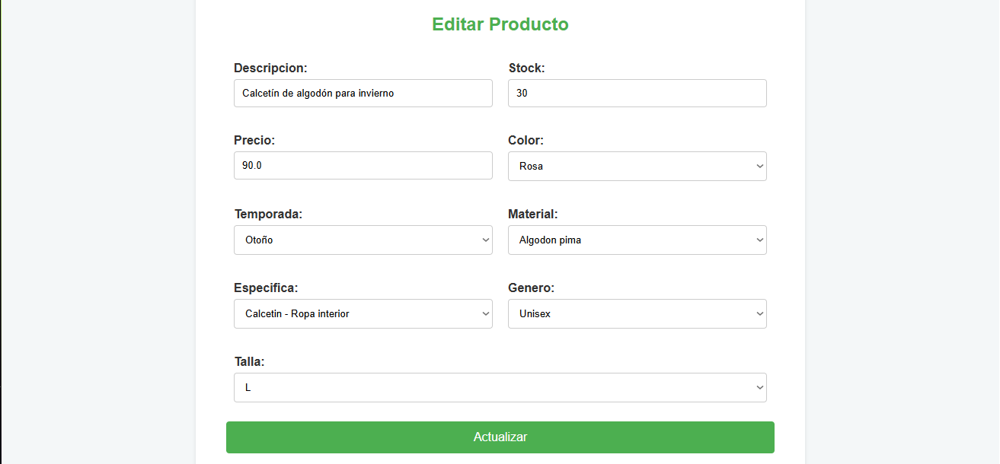

# Sistema CRUD de Productos

## Descripción
Este proyecto es un sistema CRUD para la gestión de productos específicamente diseñado para una vendedora de ropa.
Permite a los usuarios crear, editar, eliminar y visualizar todos los productos almacenados en una base de datos. Está desarrollado utilizando Spring Boot 3 para el backend,
Thymeleaf para las vistas, y CSS, HTML y Javascript para el frontend. 
La base de datos utilizada es SQL Server configurada localmente.

## Características
    
- **Crear Productos:** Añadir nuevos producto con detalles como descripción, precio, stock, genero, talla, material, temporada, color y categoria.
- **Editar Productos:** Modificar la información de los productos existentes.
- **Eliminar Productos:** Eliminar productos de la base de datos.
- **Listar Productos** Visualizar una lista de todos los productos.
- **Interfaz Intuitiva:** Diseño responsivo y amigable para una mejor experiencia de usuario.


## Tecnologías Utilizadas

- **Backend:** Spring Boot 3, Java
- **Frontend:** Thymeleaf, Html, Css, Javascript
- **Base de datos:** SQL Server (local)
- **Control de versiones:** Git
- **Otras herramientas:** Maven, IntellijIdea


## Instalación

### Prerrequisitos

- **Java JDK 17 o superior**
- **SQL Server**
- **IDE (de su preferencia para java):** IntelliJIdea, VSCode, etc. 

### Pasos

1. **Clonar el repositorio:**
   ```bash
    git clone https://github.com/C4rL0Xt/sistema_crud.git
    cd producto-service
    ```
2. **Configurar la Base de datos**
    - Inicia SQL Server y crea una base de datos llamada `contita_db`.
    - Ejecuta el script SQL proporcionado en `src/main/resources/script_tablas.sql` y `src/main/resources/insert_datos.sql` para crear las tablas necesarias.
    - Actualiza el archivo de configuración `application.properties` con las credenciales de tu base de datos:
        ```properties
         spring.datasource.url=jdbc:sqlserver://localhost:1433;databaseName=contita_db;encrypt=true;trustServerCertificate=true
         spring.datasource.username=tu_usuario
         spring.datasource.password=tu_pass
         spring.datasource.driver-class-name=com.microsoft.sqlserver.jdbc.SQLServerDriver
         spring.jpa.database-platform=org.hibernate.dialect.SQLServerDialect
        ```
3. **Construir y Ejecutar la Aplicación:**
   Navega al directorio del proyecto y ejecuta
    - La aplicación se ejecutará en `http://localhost:8080`.

4. **Acceder a la Aplicación:**
   - Abre tu navegador y ve a `http://localhost:8080` para interactuar con el sistema.

## Capturas de Pantalla

### Crear Producto


### Editar Producto


### Lista de Productos
